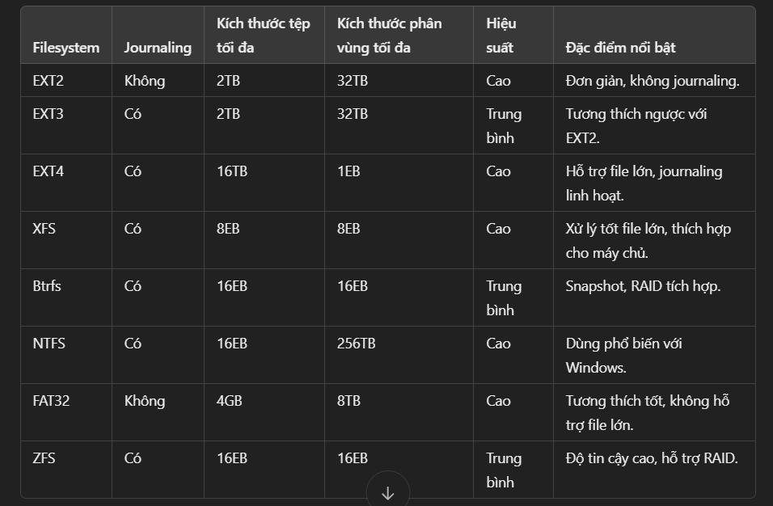

# 1. File System
## Định nghĩa: Filesystem (hệ thống tập tin) là cách hệ điều hành tổ chức, quản lý và lưu trữ dữ liệu trên thiết bị lưu trữ (như ổ cứng, SSD, USB, v.v.). Nó cung cấp phương tiện để lưu trữ dữ liệu dưới dạng tệp và thư mục, cũng như quản lý quyền truy cập và bảo vệ dữ liệu.
# 2. Các loại filesystem được Linux hỗ trợ
## - EXT2, EXT3, EXT4, XFS, Btrfs, JFS, NTFS, ...
# 3.So sánh các loại filesystem
## 
# 4. Cấu trúc thư mục phân cấp trong Linux
## - /: là thư mục root, nơi mở đầu logic cho hệ thống file của Linux. Mọi đường dẫn tuyệt đối của bất kì file nào đều bắt đầu từ /. Thư mục / chứa toàn bộ hệ điều hành. Chỉ có người dùng root mới có quyền truy cập và thay đổi trong thư mục này.
## - /bin: User binaries - thư mục lưu trữ các file nhị phân chương trình thực thi của người dùng như: pwd, cat, cp, ...
## - /sbin:  Chứa đựng các file thực thi dạng nhị phân của các chương trình cơ bản giúp hệ thống hoạt động. Các chương trình trong /sbin thường được sử dụng cho mục đích là duy trì và quản trị hệ thống => dành cho người dùng admin quản trị hệ thống
## - /boot: boot loader file - Chứa các tệp tin khởi động và cả nhân kernel là vmlinuz.
## - /dev: ác file thiết bị - nơi lưu trữ các phân vùng ổ cứng, thiết bị ngoại vi như usb, ổ đĩa cắm ngoài hay bất cứ thiết bị nào được gán vào hệ thống.
## - /etc: Chứa file cấu hình cho các chương trình hoạt động. Chúng thường là các tệp tin dạng text thường. Chức năng gần giống "Control panel" trong Windows. Các cấu hình trong /etc thường ảnh hưởng tới tất cả người dùng trong hệ thống.
### - Trong /etc còn chứa các shell scripts dùng để khởi động hoặc tắt các chương trình khác. Ví dụ: /etc/resolve.conf, sysctl.conf, ...
## - /home: thư mục chứa các file cá nhân của từng user.
## - /lib: Chứa các file library hỗ trợ cho các file thực binary. Mỗi khi cài đặt phần mềm trên Linux, các thư viện cũng tự động được download, và chúng hầu hết được bắt đầu với lib*.. Đây là các thư viện cơ bản mà Linux cần đề làm việc. Không giống như trong Windows, các thư viện có thể chia sẻ và dùng chung cho các chương trình khác nhau. Đó là một lợi ích trong hệ thống tệp tin của Linux.
## - /media:  Chứa thư mục dùng để mount cho các thiết bị có thể gỡ bỏ, di chuyển khỏi hệ thống được như CDROM, floppy, ...
## - mnt:  Chứa các thư mục dùng để system admin thực hiện quá trình mount. Như đã nói, hệ điều hành Linux coi tất cả là các file và lưu giữ trên một cây chung. Đây chính nơi tạo ra các thư mục để 'gắn' các phân vùng ổ đĩa cứng cũng như các thiết bị khác vào. Sau khi được mount vào đây, các thiết bị hay ổ cứng được truy cập từ đây như là một thư mục. Trong một số hệ điều hành, các ổ đĩa chưa được gắn sẵn vào hệ thống bởi fstab sẽ được gắn ở đây.
## - /opt: ên thư mục này nghĩa là optional (tùy chọn), nó chứa các ứng dụng thêm vào từ các nhà cung cấp độc lập khác. Các ứng dụng này có thể được cài ở /opt hoặc một thư mục con của /opt
## - /proc: Chứa đựng thông tin về quá trình xử lý của hệ thống.
<!-- ### Đây là một pseudo filesystem chứa đựng các thông tin về các process đang chạy. -->
<!-- Đây là một virtual filesystem chứa đựng các thông tin tài nguyên hệ thống. -->
<!-- Ví dụ: /proc/cpuinfo cung cấp cho ta thông số kỹ thuật của CPU. Để xem dùng lệnh cat: $cat /proc/cpuinfo -->
## - /root: Thư mục home của người dùng root.
## - /tmp: Thư mục lưu trữ các file tạm của hệ thống và các user. Các file lưu tại đây sẽ bị xóa khi hệ thống khởi động lại.
## - /usr: Chứa các file binary, library, tài liệu, source-code cho các chương trình.
### + /usr/bin chứa file binary cho các chương trình của user. Nếu như một user trong quá trình thực thi một lệnh ban đầu sẽ tìm kiếm trong /bin, nếu như không có thì sẽ tiếp tục nhìn vào /usr/bin. Ví dụ một số lệnh như at. awk, cc...
### + /usr/sbin chứa các file binary cho system administrator. Nếu như ta không tìm thấy các file system binary bên dưới /sbin thì ta có thể tìm ở trong /usr/sbin. Ví dụ một số lệnh như cron, sshd, useradd, userdel
### + /usr/lib chứa các file libraries cho /usr/bin và /usr/sbin
### + /usr/local dùng để chứa chương trình của các user, các chương trình này được cài đặt từ source. Ví dụ khi ta install apache từ source thì nó sẽ nằm ở vị trí là /usr/local/apache2
## - /var:  Chứa đựng các file có sự thay đổi trong quá trình hoạt động của hệ điều hành cũng như các ứng dụng.
### Ví dụ:
### + Nhật ký của hệ thống /var/log
### + database file /var/lib
### + email /var/mail
### + Các hàng đợi in ấn: /var/spool
### + lock file: /var/lock
### + Các file tạm thời cần cho quá trình reboot: /var/tmp
### + Dữ liệu cho trang web: /var/www
## - /srvChứa dữ liệu liên quan đến các dịch vụ máy chủ như /srv/svs, chứa các dữ liệu liên quan đến CVS.